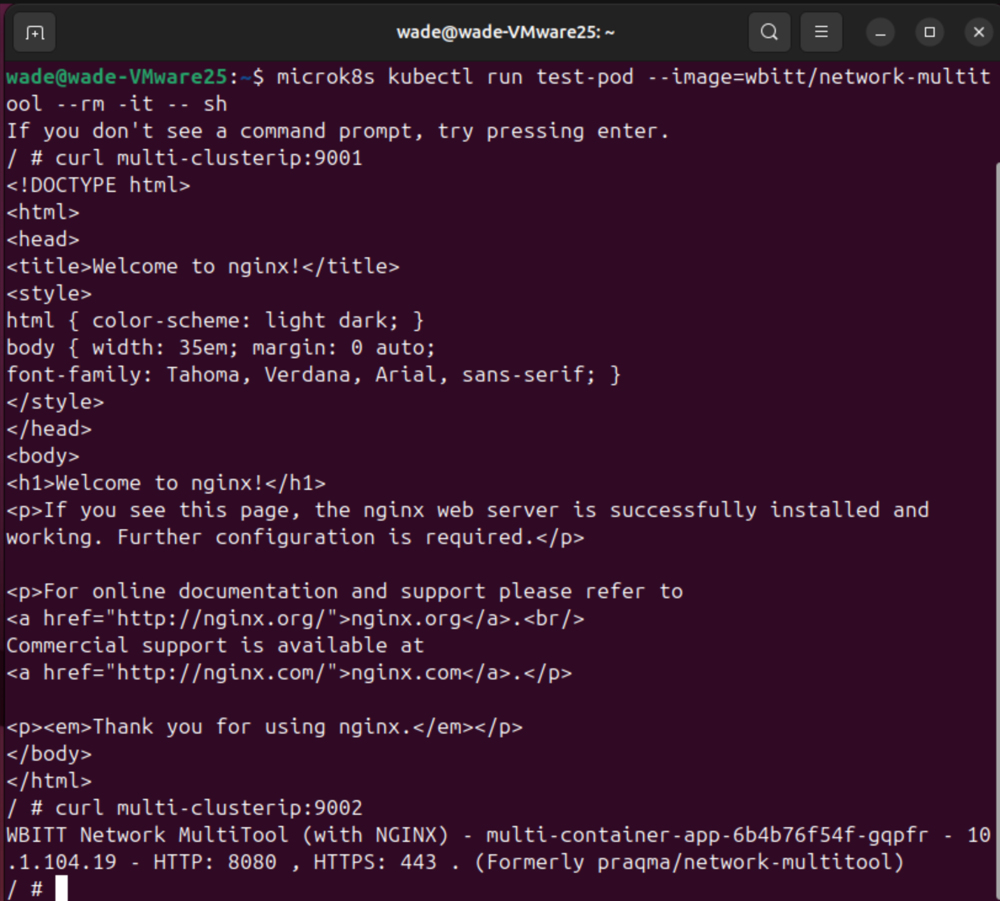
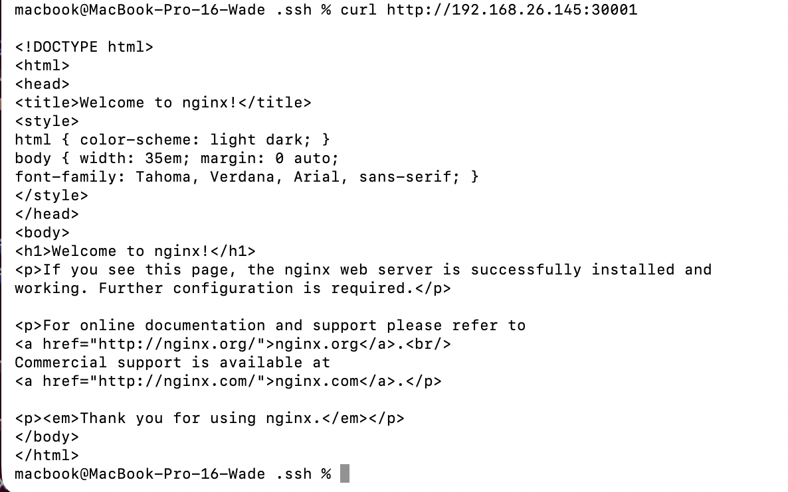
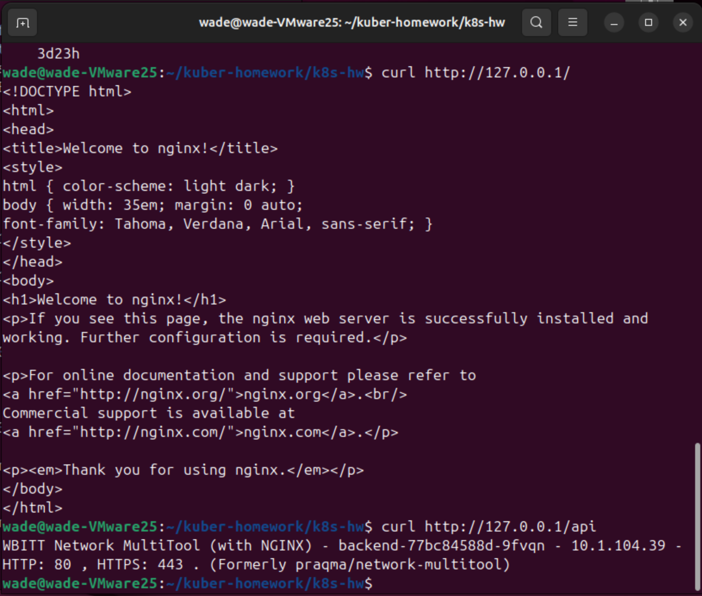

# Домашнее задание к занятию «Сетевое взаимодействие в Kubernetes» - Решетов Павел

---

### Задание 1: Настройка Service (ClusterIP и NodePort)

Задача

Развернуть приложение из двух контейнеров (nginx и multitool) и обеспечить доступ к ним:

Внутри кластера через ClusterIP.
Снаружи через NodePort.

Ответ:

---

Задание 2: Настройка Ingress

Развернуть два приложения (frontend и backend) и обеспечить доступ к ним через Ingress по разным путям.

Ответ:

---

### Правила приёма работы

1. Домашняя работа оформляется в своем Git-репозитории в файле README.md. Выполненное домашнее задание пришлите ссылкой на .md-файл в вашем репозитории.
2. Файл README.md должен содержать скриншоты вывода необходимых команд `kubectl` и скриншоты результатов.
3. Репозиторий должен содержать тексты манифестов или ссылки на них в файле README.md.
