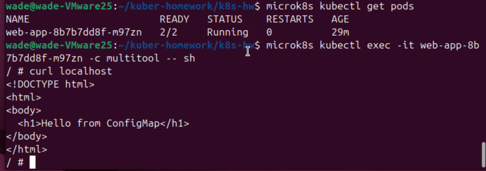
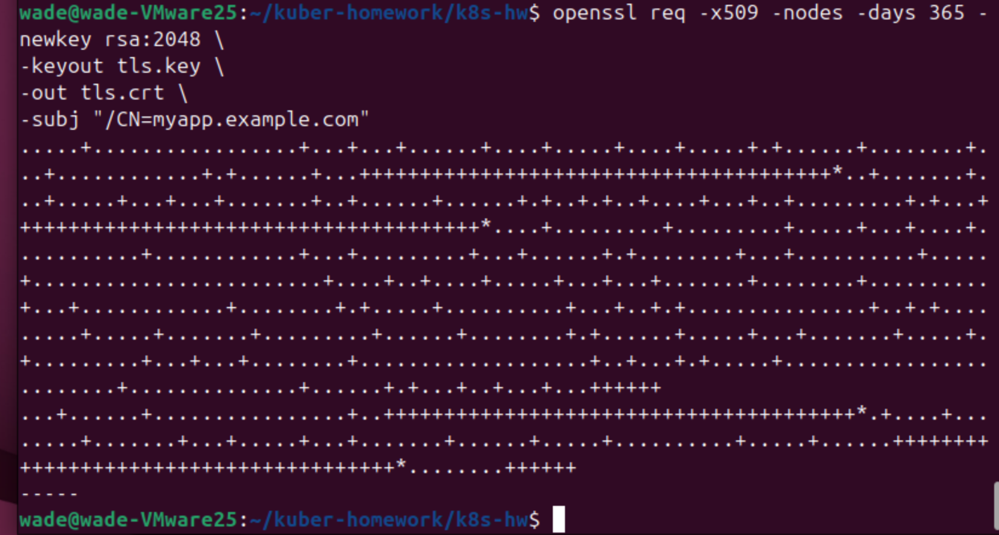
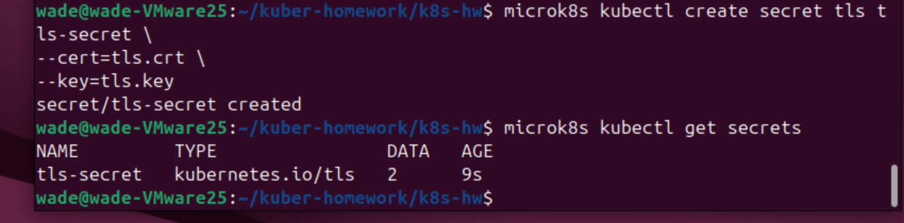
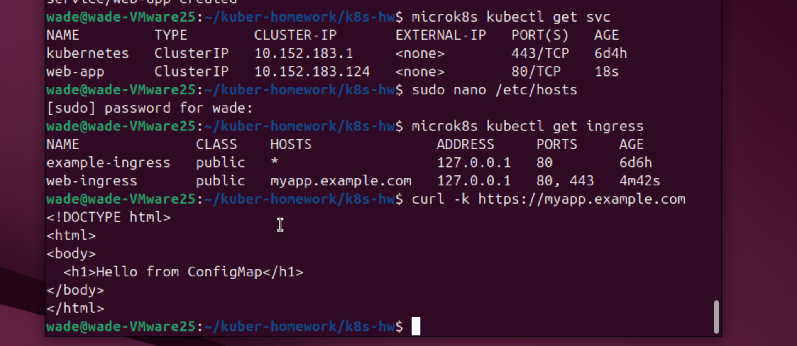
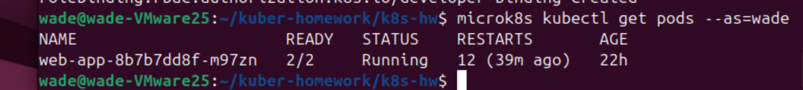
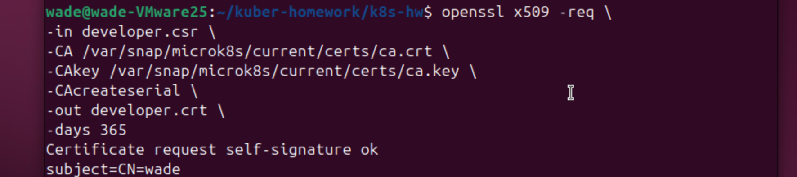
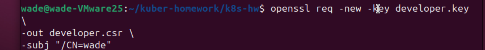

# Домашнее задание к занятию «Конфигурация приложений» - Решетов Павел

### Цель задания

---

Задание 1: Работа с ConfigMaps

Задача

Развернуть приложение (nginx + multitool), решить проблему конфигурации через ConfigMap и подключить веб-страницу.

Шаги выполнения

Создать Deployment с двумя контейнерами
nginx
multitool
Подключить веб-страницу через ConfigMap
Проверить доступность
Что сдать на проверку

Манифесты:
deployment.yaml
configmap-web.yaml
Скриншот вывода curl или браузера

Ответ:

---

Задание 2: Настройка HTTPS с Secrets

Задача

Развернуть приложение с доступом по HTTPS, используя самоподписанный сертификат.

Шаги выполнения

Сгенерировать SSL-сертификат
openssl req -x509 -nodes -days 365 -newkey rsa:2048 \
 -keyout tls.key -out tls.crt -subj "/CN=myapp.example.com"
Создать Secret
Настроить Ingress
Проверить HTTPS-доступ
Что сдать на проверку

Манифесты:
secret-tls.yaml
ingress-tls.yaml
Скриншот вывода curl -k

Ответ:

---

Задание 3: Настройка RBAC

Задача

Создать пользователя с ограниченными правами (только просмотр логов и описания подов).

Шаги выполнения

Включите RBAC в microk8s
microk8s enable rbac
Создать SSL-сертификат для пользователя
openssl genrsa -out developer.key 2048
openssl req -new -key developer.key -out developer.csr -subj "/CN={ИМЯ ПОЛЬЗОВАТЕЛЯ}"
openssl x509 -req -in developer.csr -CA {CA серт вашего кластера} -CAkey {CA ключ вашего кластера} -CAcreateserial -out developer.crt -days 365
Создать Role (только просмотр логов и описания подов) и RoleBinding
Проверить доступ
Что сдать на проверку

Манифесты:
role-pod-reader.yaml
rolebinding-developer.yaml
Команды генерации сертификатов
Скриншот проверки прав (kubectl get pods --as=developer)

Ответ:

---
